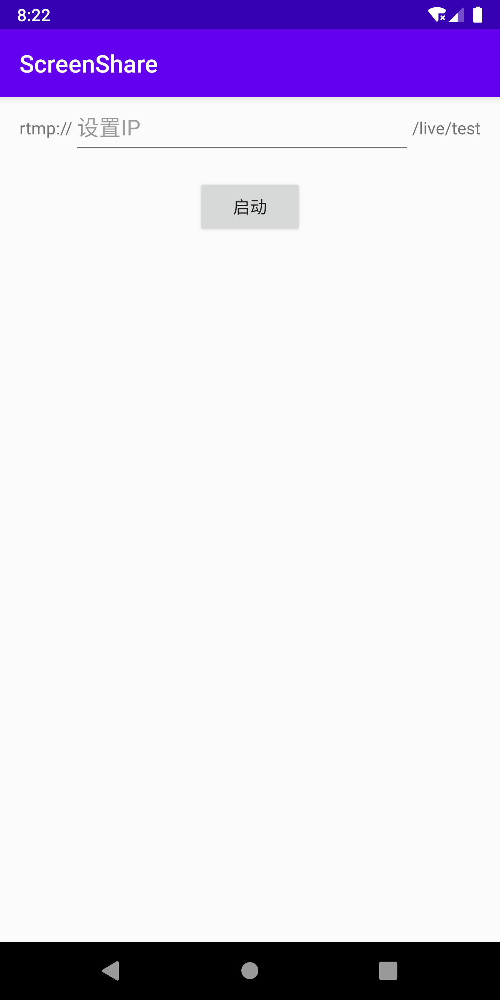

# ScreenShare
------------------------------
### 测试服务器 [Node-Media-Server](https://github.com/illuspas/Node-Media-Server)

- 运行服务器运
- 打开APP，输入IP点击启动

### 电脑端
ffplay播放测试：`ffplay rtmp://<ip>/live/test`

#### 使用的三方库
----
[SimpleRtmp](https://github.com/faucamp/SimpleRtmp)

[yasea](https://github.com/begeekmyfriend/yasea)